> 들어가기 앞서, 이 글은 저의 Notion에 있던 paper review를 재구성한 것으로, 일부 목록을 chatgpt 를 사용하여 재구성되었습니다. 따라서 어색한 문구나 적절하지 않은 설명이 존재할 수 있으니, 양해 부탁드리며, 알려주시면 감사하겠습니다.

## 1. Introduction

많은 NLP 시스템은 단어를 atomic 하게 바라보며, 유사성(similarity)의 개념을 활용하지 않는다. 물론 이러한 접근 방식은 단순하다는 장점이 있으며, 매우 큰 corpus에서 학습할 경우 complexed 모델보다 뛰어난 성능을 보이는 경우도 있다. 그러나 기계 번역과 같은 특정 task에서는 간단한 모델의 한계가 분명히 존재하게 되며, 특히 데이터 풀이 작은 경우 그 한계가 명확해진다. 

더불어, 최근 머신러닝 기술의 발전으로 인해 대규모 데이터셋을 다루는 복잡한 모델들이 단순한 모델의 성능을 능가하고 있다. 이에 따라 단어의 distributed representation을 사용하는 것은 성공적인 접근 방식이 될 것이다.

### 1.1 Goals of the Paper

이 논문의 목적은 huge dataset (billions of words & millioins of vocabs)에서 high-quality word vectors를 학습하는 데 사용되는 기술들을 소개하는 것이다. 유사한 단어들의 vectors가 단순히 가까울 뿐만 아니라, **multiple degrees of similarity**를 가지는 점을 고려하여 제안된 measuring 방식을 사용할 것이다. 놀랍게도, 현재 **syntactic regularities**를 가지는 기술도 존재한다 (*vec("King") - vec("Man") + vec("Woman") == vec("Queen")*). **syntactic**과 **semantic regularities**를 모두 가지는 모델을 설계하고, WordVec의 dimension이 time과 accuracy에 미치는 영향을 파악하는 것이 최종 목표이다.

### 1.2 Previous Work

단어를 연속된 vector로 표현하는 것에는 긴 역사가 있지만, 지금까지는 NNLM의 아키텍처를 처음 활용한 모델이 가장 유명한 모델이었다. 다른 NNLM 아키텍처로는, 먼저 single-hidden layer 모델을 통해 word vector를 학습한 후, 이를 NNLM에 적용한 사례가 존재하는데, 이는 NNLM 아키텍처의 구조를 몰라도 학습이 가능하다. 따라서 우리는 이 아키텍처를 확장하여 **word vector를 학습시키는 첫 번째 과정에 집중**할 것이다. 이후에는 word vector가 여러 NLP application에서 성능을 향상시킬 수 있다는 것이 입증되었으며, word vector의 estimation을 통해 학습 시 좋은 성능을 보였다. 그러나 이 과정은 너무 많은 computing power를 소모하므로, 더 효율적인 과정이 필요하다.

## 2. Model Architectures

 - LSA 설명 (개잘써있음) 

[Latent Semantic Analysis(LSA)](https://sragent.tistory.com/entry/Latent-Semantic-AnalysisLSA)

- LDA 설명 

[Latent Dirichlet Allocation(LDA)](https://towardsdatascience.com/latent-dirichlet-allocation-lda-9d1cd064ffa2)

- etc,, 보면 좋은것

[SVD와 PCA, 그리고 잠재의미분석(LSA) · ratsgo's blog](https://ratsgo.github.io/from%20frequency%20to%20semantics/2017/04/06/pcasvdlsa/)

단어들의 연속적인 표현을 벡터로 추정하는 방식은 이미 여러 방식으로 제기되어 왔다 (예: LSA, LDA 알고리즘 등). LSA, LDA와 같은 알고리즘들이 존재하지만, 이 논문에서는 LSA보다 성능이 뛰어나다고 알려진 Neural Network(NN)를 이용해 **distributed representations of words**를 구하는 데 초점을 맞출 것이다. 특히, LDA는 문서와 단어의 수가 증가할 때 complexity가 너무 커지는 단점이 있다. 서로 다른 모델을 비교하고 평가하기 위해서는 첫 번째로 **computational complexity**를 정의해야 하며 (예: 모델에 사용되는 parameter 수), 이후에는 accuracy를 극대화하면서 complexity를 줄이는 것을 목표로 해야 한다.

이후에 나오는 모델의 complexity 는 다음과 같이 계산한다.

$$
O = E \times T \times Q
$$

E - #Epoch (commonly 3 ~ 50)

T - #words (commonly up to one billion)

Q - defined further for each model architecture

그리고, 모든 모델은 SGD 와 역전파를 이용하여 학습된다. 

### 2.1 FeedForward Neural Net Language Model (NNLM)

*물론 논문의 object 상으로는 개념만 알면 되는 부분이긴 하지만, NNLM 조차 처음 접해봤기에 아예 새로 공부한다는 느낌으로 알아보았는데, 뭔가 설명이 멋대로라 조금 힘들었던 부분…*

*(이해가 안되는 것을 끼워맞추느라 오류가 있을 여지가 다분하니 틀렸다면 알려주시면 감사하겠습니다 😢)*

N 개의 이전 단어들을 보고 다음에 올 단어를 예측하는 Language model이다. 이 모델은 총 4개의 layer로 구성되어 있으며, Input layer, Projection layer, Hidden layer, Output layer가 포함된다. 입력 데이터는 one-hot encoding(1xV, V는 vocabulary의 개수)으로 되어 있으므로, 이를 projection을 통해 차원을 축소할 필요가 있다. N 개의 1xV 벡터가 입력되면, 이들을 VxD 행렬로 projection하여 (D는 임의의 수로, 차원 축소를 위해 사용됨) 1xD 벡터로 변환한다. 이 과정에서 벡터가 one-hot encoding 되어 있으므로, projection matrix의 row를 그대로 가져오는 **look-up table**의 기능을 수행한다고 볼 수 있다.

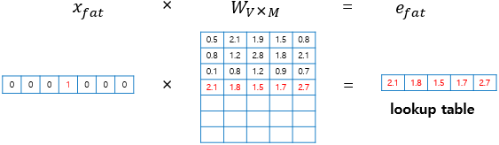

변환된 projected vector (1xD) N 개를 하나의 column으로 이어붙인다. 따라서 결과적으로 1x(NxD) 크기의 벡터가 된다.

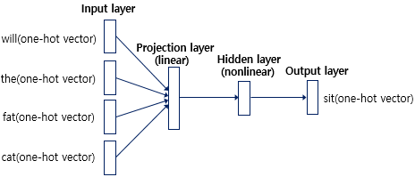

1x(NxD) 벡터를 (NxD)xH 크기의 hidden layer matrix를 통해 1xH 벡터로 변환한다. **(tanh 함수로 활성화하기 때문에 non-linear hidden layer라고 불린다.)** 마지막으로, 1xH 벡터를 HxD 크기의 output matrix를 사용하여 1xV 벡터로 변환한 후, softmax를 통해 추론한다.

이런 식으로 작동하는 model 인데, 이전에 computational complexity 에 사용되었던 **Q** 라는 변수를 계산해보면 다음과 같다. (파라미터들의 개수)

$$
Q = N \times D + N \times D \times H + H \times V 
$$

사용된 파라미터들의 수를 따져 보았을 때, 첫번째 projection 에 사용된 파라미터의 수가 VxD 가 되어야 할 텐데, 왜 NxD 로 되어있는지 잘 모르겠다면 정상인데, 내가 내린 결론은 다음과 같다. (물론 아닐수도 ㅎㅎ)

<aside>
💡

전체적인 파라미터의 수는 VxD 개가 맞지만, 실제로 Projection matrix 의 파라미터가 모두 쓰이는 것이 아니라, 단순 loop-up table 의 역할만을 수행하기 때문에 NxD 개만이 쓰이게 된다. 그렇기에 역전파 시에 조정되는 파라미터의 개수 또한 NxD 개이기 때문에, 복잡도에 사용하는 파라미터의 수 또한 NxD 로 계산해도 무방하다. 

</aside>

common example 을 살펴보면, (N = 10, D = 500~ 2000, H = 500 ~ 1000) HxV  부분이 bottleneck 이 되는데, hierarchical softmax 함수를 사용하거나 Huffman binary tree (가장 많은 빈도수의 단어를 이진으로 표현하는 것)  로 vocab을 축소시켜 H x log(V) 만큼 줄일 수 있게 된다. 

(따라서 bottleneck 은 NxDxH 부분이 된다.)

### 2.2 Recurrent Neural Net Language Model (RNNLM)

NNLM에서 N(context length)을 미리 지정해야 하는 단점을 제거하였으며, shallow한 NN보다 더 효과적으로 복잡한 패턴을 표현할 수 있는 장점이 있다. NNLM과 비슷한 구조를 가지고 있지만, Projection layer는 사라지고 hidden layer가 스스로 피드백하는 구조로 되어 있다.

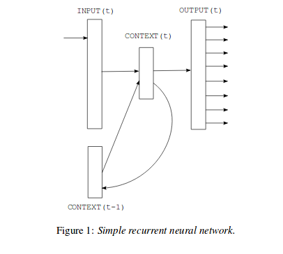

Projection Layer 가 필요 없는 이유는 chat gpt 가 이렇게 알려주는데,, 솔직히 잘 와닿지 않아서 가감없이 알아서 잘 해석하시라고 캡쳐해서 남겨두겠다.. (혹시 아시는 분이 있다면 알려주시면 감사하겠습니다..!!)

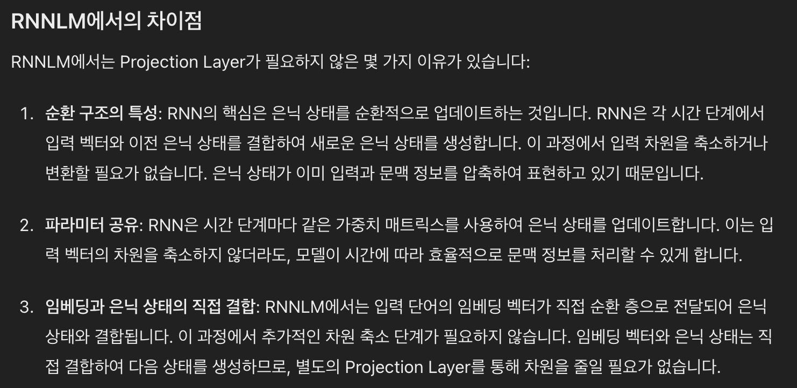

그래서 RNNLM 의 complexity 는 다음과 같다. 

$$
Q = H \times H + H \times V
$$

NNLM 의 복잡도에서 단지 N 이 사라지고 (1개의 벡터만 input으로 작용한다.) hidden layer 에서 다시 hidden layer 로 이어지는 recursive 한 파라미터가 HxH, 그리고 output layer 이 HxV 로 생각할 수 있다. (그리고 앞선 feedforward model 과 마찬가지로 HxV 는 Hxlog(V) 로 축소가 가능하다.)

(Input layer 에서의 복잡도는 마찬가지로 one-hot encoding 되어있는 벡터이기에 복잡도가 trivial 하다.)

### 2.3 Parallel Training of Neural Networks

이 논문은 제목 그대로 NN을 parallel하게 학습할 수 있는 방법을 제안하며, Google에서 개발한 DistBelief라는 framework를 사용한다. Feedforward NNLM과 본 논문에서 제안하는 방식 모두 **DistBelief** framework 위에서 작동하며, DistBelief는 대규모 신경망을 처리하기에 적합하다. 이 프레임워크는 여러 서버를 두어 병렬로 학습하고, 파라미터 서버를 따로 두어 그 서버에 파라미터를 저장하고 공유하는 방식으로 작동한다.

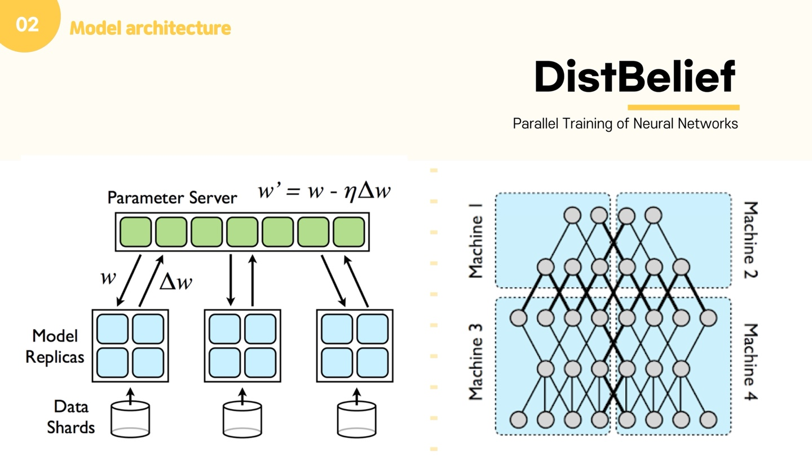

## 3. New Log-linear Models

이제 우리는 word를 vector로 학습시키는 두 가지 모델 아키텍처를 제안할 것이며, computational complexity를 줄이기 위해 이에 집중할 것이다. 지금까지 소개된 모델들을 살펴보면, 모두 complexity의 병목 현상이 hidden layer 부근에서 발생한 것으로 보인다. 따라서 우리는 더 단순한 모델을 제안할 것이며, NN으로 정확하게 표현되지 않는 하나의 simple 모델도 함께 제안할 것이다.

전과 마찬가지로, **word vector들을 simple model로 학습시켜 임베딩한 후, 이를 다시 다른 feedforward NNLM 모델에 적용하는 방식**으로 진행할 것이다. 지금까지도 많은 word vector 학습 모델들이 제안되었지만, 이 방식이 가장 간단하다.

### 3.1 Continuous Bag-of-Words Model

앞서 설명한 feedforward 모델의 구조와 유사하다. 그러나 이 모델에서는 non-linear hidden layer가 삭제되었으며, projection layer는 모든 단어에 대해 공유되어 있다. 이는 단순히 projection matrix만 공유하는 것이 아니라, 결과값의 차원도 공유된다는 의미다. 또한, projected된 모든 벡터는 동일한 위치에서 결합되며, 결국 모든 projected vector를 합쳐 평균을 계산하게 된다.

이게 바로 Countinuous Bag-of-Words , 줄여서 **CBOW** model 이다. 

이 모델은 NNLM 모델과 다르게 과거의 단어들만 input 으로 사용하는 것이 아니라, **future words 또한 input 으로 사용**하여 중간의 단어를 예측한다. 

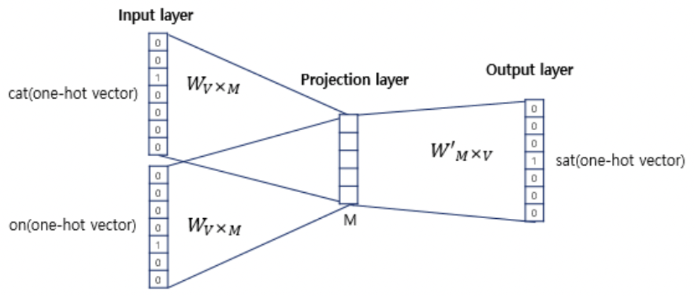

“Cute cat sat on my table” 이라는 문장을 예시로 들었을 때, sat 좌우로 n 개의 (위의 예시에서는 n = 1) 단어들을 input vector (one-hot encoding) 로 넣어 중간 “sat” 을 예측한다. 

NNLM과 마찬가지로 1xV 벡터가 들어가 VxM 크기의 projection matrix 를 통해 차원 축소되고, 이 벡터들을 모두 합쳐 MxV 크기의 output matrix 와 곱해져 1xV 크기의 벡터로 출력된다. (물론 여기서 softmax 함수도 사용한다.)

따라서 지금까지 했던 것과 마찬가지로 계산복잡도를 계산해보면 아래와 같다. 

$$
Q = N \times D + D \times \log_{2}{V}
$$

(hidden layer 가 사라져 계산복잡도가 대폭 줄어든 것을 볼 수 있다 !)

### 3.2 Continuous Skip-gram Model

CBOW와 유사한 구조이지만, 주변 context를 사용하여 현재 단어를 예측하는 것보다, 한 단어를 바탕으로 다른 단어를 예측하는 classification 능력에 더 초점을 맞춘다. 구체적으로는, 현재 단어를 input으로 하여 일정 거리 내의 주변 단어들을 예측하는 모델이다. 이는 CBOW 모델과 비교해 input과 output이 뒤바뀐 형태다. 모델 성능을 향상시키기 위해서는 "일정 거리"를 늘리면 되지만, 이 과정은 computational complexity를 증가시킨다. 또한, 먼 거리에 있는 단어가 현재 단어에 미치는 영향이 더 적다고 판단하여, 멀리 떨어진 단어에는 작은 가중치를 부여해 자동으로 학습시킨다.

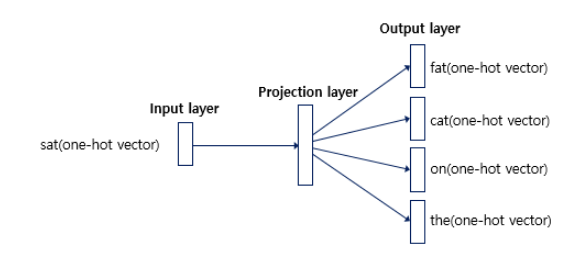

사진에 나와있듯이, input layer 에서 projection layer 으로 갈 때, 1xV 벡터가 1개 입력되어 VxD projection matrix 로 임베딩된다. 그리고, 중심 단어로부터 얼마나 떨어진 단어까지 볼 것인지를 hyperparameter 인 C 로 정의한다면, 마지막 projection layer 에서 output layer 로 진행될 때, C 개의 DxV output matrix 를 통해 C 개의 vector를 출력하게 된다. 

마찬가지로 계산복잡도 Q를 계산해보면 다음과 같다. 

$$
Q = C\times (D + D \times log_2V)
$$

1개의 단어를 기준으로 C개의 output 이 생성되기 때문에, 각 C 개의 데이터를 하나하나 살펴보면, D + D x log(V) 만큼의 계산복잡도가 나오며, 이를 C번 반복한 값이 결국 복잡도가 되겠다. 

## 4. Results

다양한 word2vec 기법의 정확도를 평가하기 위해, 이전 논문들은 보통 특정 단어와 가까운 벡터를 가진 단어들의 table을 작성하고, 이를 직관적으로 **"납득"**하는 방식에 그쳤다. **예를 들어, 누구나 France와 Italy가 비슷한 단어라는 것을 직관적으로 알 수 있지만, 단순한 similarity에서 나아가 big - bigger, 또는 big - biggest와 같은 다양한 similarity도 존재한다. 이러한 다양한 유사성을 파악하는 것이 더욱 도전적인 과제가 될 것이다.** 

놀랍게도, 이러한 similarity는 벡터 간의 간단한 연산으로도 파악할 수 있다. 예를 들어, 앞서 설명한 것처럼 *vec("King") - vec("Man") + vec("Woman") == vec("Queen")*이라는 연산을 통해 유사한 벡터를 찾아낼 수 있다. (여기서 "=="는 유사한 벡터를 의미하며, cos similarity를 뜻함) 이러한 과정을 통해 높은 차원의 word vector로 large dataset을 학습하면, 미묘한 similarity 관계에 있는 단어들까지도 파악할 수 있으며, 이는 향후 NLP application을 개발할 때 큰 도움이 될 것이다.

### 4.1 Task Description

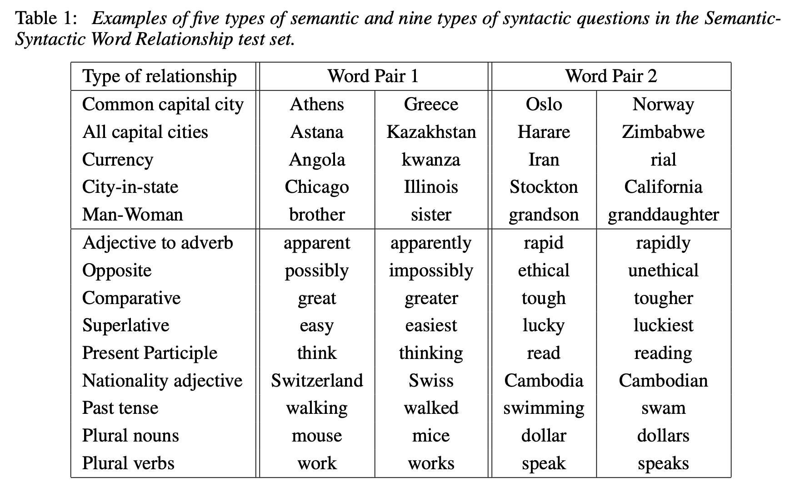

위의 Table 1에서처럼, 5가지 형태의 semantic 질문과 9가지 형태의 syntactic 질문을 구성하였다. 각 relationship마다 질문을 생성할 때, 해당되는 모든 데이터를 모아 두 개씩 뽑아 질문을 만들었다. 예를 들어, 미국의 모든 도시와 주의 이름을 모은 후, 두 개씩 골라서 질문을 형성하는 방식으로 진행되었다. (nC2)

각 semantic 및 syntactic 질문에 대해 정확도를 계산했다. 이때, 가장 가까운 벡터가 정답 단어와 정확히 일치해야만 정답으로 간주되었으며, 동의어는 mistake로 처리되었다. 이는 단어의 어원이나 형태에 대해 별도의 정보를 학습하지 않았기 때문에 100%의 정확도를 달성하는 것은 사실상 불가능하다는 점을 반영한 결과였다.

### 4.2 Maximization of Accuracy

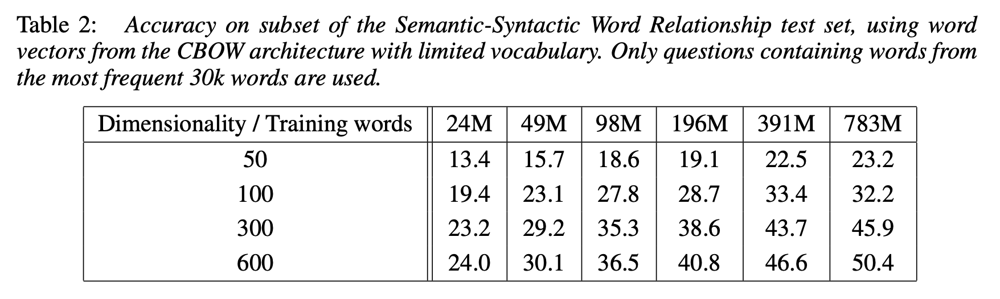

- Dimensionality 와 Training words 를 늘려가 보았을 때, 정확도가 분명 증가하긴 하지만, 일정 수준을 넘어서면, 그 증가폭이 현저히 떨어짐.
- 기존의 많은 연구에서는 하나만을 증가시켜 accuacy 를 보는 경우가 많았는데, training 하는 단어 수가 많아짐에 따라서 단어를 표현하는 차원의 수 또한 증가시켜야 제대로 된 vectorize 가 일어나게 됨.

### 4.3 Comparison of Model Architectures

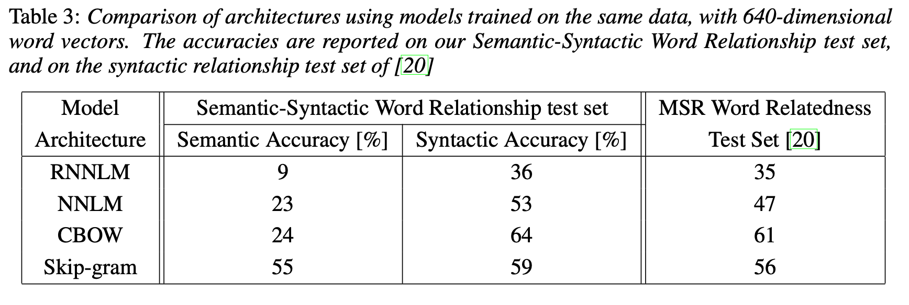

- RNNLM 이 가장 낮은 성능을 보임. 또한 CBOW 와 Skip-gram word2vec 방식은 RNNLM 과 NNLM 방식 보다 높은 accuracy를 보임.

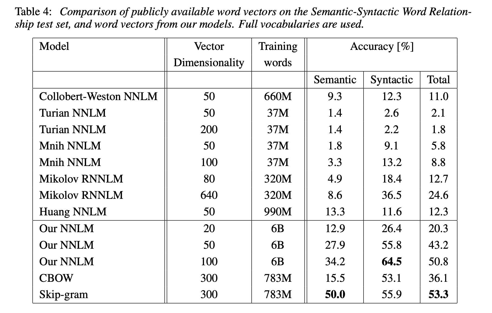

- 다른 여러 NNLM과 비교했을 때에도, CBOW와 Skip-gram은 훨씬 높은 성능을 보임.

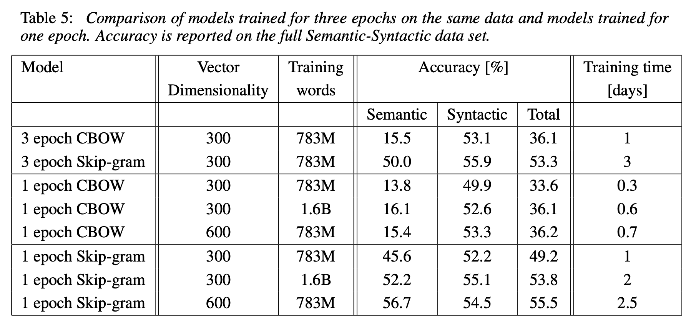

- 각 epoch 와 dimensionaliry, words 수에 따른 정확도와 걸린 시간.

### 4.4 Large Scale Parallel Training of Models

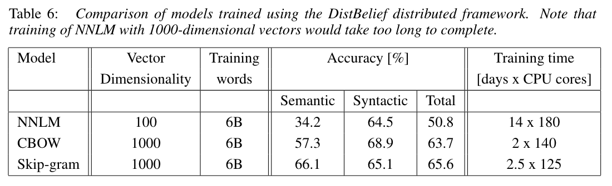

- 앞서 설명했던 DistBelief framwork 를 사용해서 학습한 결과, 다음과 같은 정확도가 나옴.

### 4.5 Microsoft Research Sentence Completion Challenge

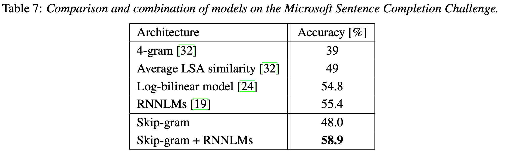

- 본 챌린지에서 Skip-gram 단독 모델로는 다른 모델들에 비해 낮은 성능을 냈지만, RNNLMs 와 결합한 모델을 사용하게 되면, 58.9%로 SOTA를 달성함.

## 5. Examples of the Learned Relationships

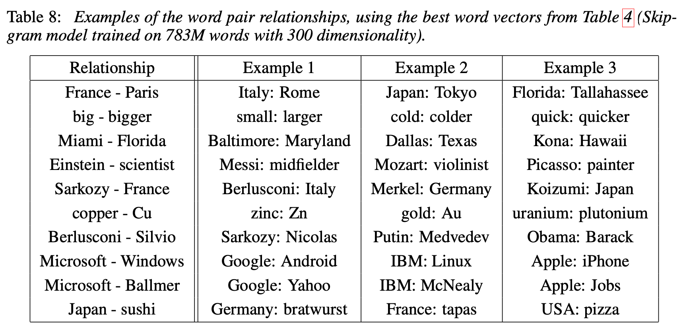

- 본 논문에서는 단어 사이의 유사도를 측정하는 test 에서 60% 정도의 정확도를 달성했음. 더 높은 정확도를 위해서는 더 다양한 dataset 을 사용하고, 단어 사이의 상관관계 벡터를 여러 단어쌍들의 subtract 벡터의 평균으로 만들면 될 것.

## 6. Conclusion

CBOW와 Skip-gram이라는 새로운 임베딩 기술을 제안했으며, 기존의 여러 model들에 비해 계산복잡도가 현저히 작은 간단한 model임에도 매우 높은 성능을 보였다. 또한, Semantic 을 넘어 Syntactic regularities 까지 측정이 가능했다.